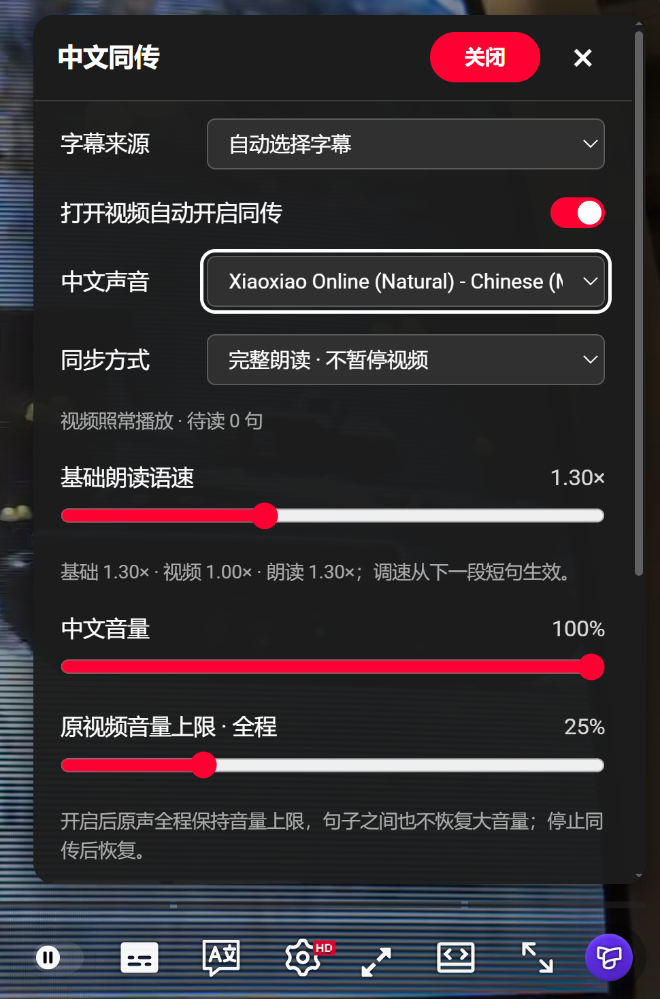
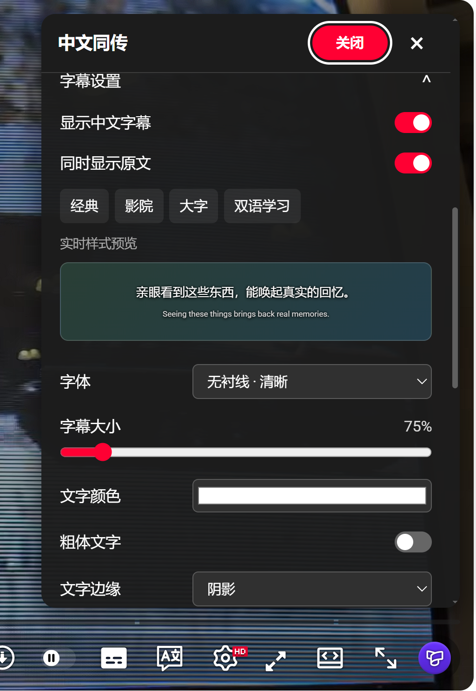
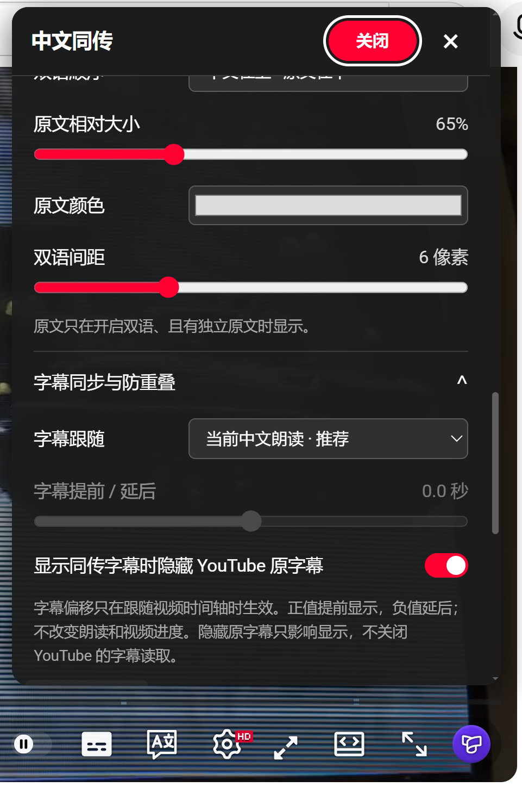

<div align="center">

# YouTube 中文同传

看 YouTube，听中文。

把视频字幕翻译成中文，用 Edge 中文声音逐句朗读。视频照常播放，声音、双语字幕和常用设置都在播放器里完成。

[下载安装包](https://github.com/lhl1/youtube-progress-dub/releases/latest) · [反馈问题](https://github.com/lhl1/youtube-progress-dub/issues) · [更新记录](CHANGELOG.md)

[](https://github.com/lhl1/youtube-progress-dub/actions/workflows/ci.yml) [](LICENSE)

</div>

适用于电脑端 Microsoft Edge，主要面向有字幕的 YouTube 普通视频。自动生成的字幕也可以使用；完全没有字幕的视频，目前不能直接识别音轨。

## 阅读导航

[功能一览](#功能一览) · [界面预览](#界面预览) · [安装与更新](#安装与更新) · [开始使用](#开始使用)

[朗读与音量](#朗读与音量) · [字幕与画面](#字幕与画面) · [长视频与翻译](#长视频与翻译) · [默认设置](#默认设置)

[隐私与权限](#隐私与权限) · [常见问题](#常见问题) · [开发与打包](#开发与打包)

## 功能一览

| 功能 | 使用时的效果 |
| --- | --- |
| 中文朗读 | 把字幕译成中文，再调用浏览器提供的中文声音读出来。 |
| 完整朗读 | 每句读完再读下一句，视频照常播放；跟不上时保留待读内容。 |
| 视频倍速联动 | 视频调快，中文朗读也跟着加速，不需要重新设置两遍。 |
| 原声全程音量上限 | 同传期间保持较低原声，句子之间不会忽大忽小。 |
| 双语字幕 | 中文和原文一起看，字体、大小、颜色、位置和背景都能调整。 |
| 播放器内设置 | 点击齿轮旁的白色同传图标即可设置，常用操作不用打开新窗口。 |
| 自动开启 | 设置一次，以后打开或切换视频自动开启同传。 |
| 长视频与跳转 | 随进度持续准备翻译，跳转后优先处理新位置，回看时使用缓存。 |
| 字幕来源选择 | 在面板顶部直接选择字幕，方便切换语言或字幕版本。 |
| 字幕导出 | 把已经准备好的译文导出为 SRT，方便保存和复习。 |
| 自定义翻译服务 | 默认无需密钥，也可配置自己使用的翻译接口。 |

只有 YouTube 自动生成的字幕会尝试按意思分段。人工／原生字幕保留原来的每条文字和时间，不合并、不拆分。

## 界面预览

点击播放器控制栏中的白色“中文同传”图标打开面板。下面三张图分别展示朗读设置、字幕外观和字幕同步；点击可查看原图。

| 朗读与音量 | 字幕外观与预览 | 双语与字幕同步 |
| --- | --- | --- |
| [](docs/images/player-settings.png) | [](docs/images/subtitle-style.png) | [](docs/images/subtitle-sync.png) |

## 安装与更新

### 第一次安装

1. 打开 [下载页面](https://github.com/lhl1/youtube-progress-dub/releases/latest)，下载扩展 ZIP。
2. 把 ZIP 解压到一个长期保留的文件夹。
3. 在 Edge 地址栏输入 `edge://extensions`，打开“开发人员模式”。
4. 点击“加载解压缩的扩展”，选择解压后的文件夹。这个文件夹里应直接有 `manifest.json`。
5. 刷新已经打开的 YouTube 页面，再点击播放器齿轮旁的“中文同传”图标。

加载后请保留这个文件夹，浏览器会继续从这里读取扩展文件。如果下载的是 GitHub 的源码压缩包，应选择里面的 `YouTube中文同传/` 子文件夹。

| 下载内容 | 用途 |
| --- | --- |
| 扩展 ZIP | 推荐安装方式：解压后加载文件夹。 |
| CRX | 签名安装包；浏览器可能限制非商店来源的直接安装。 |
| SHA256SUMS.txt | 检查下载文件是否完整，包含 ZIP 与 CRX 的 SHA-256 校验值。 |
| Source code | 完整源码，适合查看实现或参与开发。 |

插件目前没有上架扩展商店。使用解压文件夹安装即可，无需修改注册表或浏览器安全策略。

### 更新已有安装

1. 下载新版本，替换原扩展文件夹中的文件。
2. 在 `edge://extensions` 找到本扩展，点击“重新加载”。
3. 刷新 YouTube 页面。

已有个人设置会保留。想应用推荐配置，在播放器面板中点击“恢复推荐设置”；只想重置字幕外观，可点击“恢复字幕默认”。

## 开始使用

### 声音与字幕

打开面板后，先点击“试听声音”，确认设备能播放中文。默认优先选择晓晓自然声音；设备没有对应声音时，会使用可用的备用中文声音，也可以手动选择。

“字幕来源”位于面板顶部。一般使用“自动选择字幕”即可；视频有多个语言或多个字幕版本时，可手动选择需要的来源。

浏览器有时要求页面中的真实点击才允许播放语音。首次自动开启后如果没有声音，请点击一下视频中的按钮，再试听或重试。

### 自动开启与手动关闭

| 操作 | 后续行为 |
| --- | --- |
| 打开“打开视频自动开启同传” | 立即开启当前视频，并在以后打开或切换视频时自动开启。 |
| 手动点击面板中的“关闭” | 当前视频保持关闭；下一条视频继续按自动开启设置运行。 |
| 关闭自动开启开关 | 以后的视频不再自动开启；当前正在运行的同传需单独点击“关闭”。 |

播放器图标开启和关闭时保持相同的白色样式，不显示红色状态条。是否正在运行，可在面板内查看。

### 面板操作

常用设置修改后即时生效，并自动保存到本机。点击面板外、YouTube 其他按钮，或按 Esc，面板自动收起，正在运行的同传继续播放。

面板支持全屏，内容较多时在面板内滚动。只有首次配置自定义翻译接口和密钥等操作，才需要打开高级设置页；高级页修改后要点击“保存设置”。

## 朗读与音量

### 两种朗读方式

| 方式 | 中文怎么读 | 适合什么情况 |
| --- | --- | --- |
| 完整朗读 · 不暂停视频（默认） | 一句读完再读下一句。视频继续播放，来不及读完时保留后续内容，允许中文落后。 | 希望每句都读完，可以接受中文与视频有延迟。 |
| 跟随视频 · 自动语速 | 尽量跟上视频，根据字幕长度和剩余时间调整速度；内容过密时可能截断超时朗读。 | 更重视与视频进度接近的日常观看。 |

例如，一句中文需要 6 秒才能读完，但下一句字幕 4 秒后就出现了：完整模式会先读完这句，再接着读下一句，视频不会被插件暂停。

完整模式的面板会显示待读句数和落后时间。视频结束后，仍会继续读完剩余内容；手动拖动进度、切换视频或停止同传，会清除旧位置的待读内容。

### 音效标记和符号只停顿

从 1.7.1 起，中括号里的内容不朗读，例如 `[音乐]`、`[Music]`、`[__]`。全角方括号和 `【】` 同样处理。特殊符号与表情只留短停顿，普通文字、数字和小数继续读；逗号、句号等用于自然停顿。

例如 `你好[音乐]世界✨[__]再见。` 会读“你好”，短停顿后读“世界”，再短停顿后读“再见”。字幕仍保留完整文字。暂停视频会冻结剩余停顿时间，恢复后继续；跳转或停止会取消旧计时，不会冒出旧句子。这项功能默认生效，不需要设置开关。

### 暂停、缓冲与恢复

手动暂停视频时，中文也会暂停。继续播放后优先接着未完成的片段读，已经完成的片段不会主动重播。缓冲期间会等待视频真正恢复播放；广告期间也会暂停朗读。

浏览器丢失语音状态时，插件会尝试恢复尚未完成的片段。这个片段可能从头重读；仍有异常时，可点击“恢复 / 重试”，或更换中文声音。

### 语速跟着视频倍速走

实际朗读速度 = 你设置的基础语速 × 视频播放倍速。

| 基础语速 | 视频倍速 | 完整模式的朗读速度 |
| --- | --- | --- |
| 1.30 倍 | 1.00 倍 | 1.30 倍 |
| 1.30 倍 | 1.50 倍 | 1.95 倍 |
| 1.30 倍 | 2.00 倍 | 2.60 倍 |
| 1.00 倍 | 2.00 倍 | 2.00 倍 |

调速不会清空待读内容，也不会强行打断当前短句。新速度从下一朗读片段生效；跟随模式为了赶上视频，必要时还会进一步提速。不同声音可能有自身的速度限制。

播放器内试听会结合当前视频倍速；独立高级设置页的试听使用基础语速。

### 原声保持稳定

开启同传后，原视频全程遵守设定的音量上限，默认 25%。两句中文之间、暂停、缓冲、跳转和广告期间，都不会因为中文暂时没在读而恢复大音量。停止同传后才恢复。

原本低于上限的音量不会被调高。你手动调得更低时，插件尊重这个较低音量；尝试调高时，仍遵守上限，并记住目标音量，在停止同传后恢复。把上限设为 0%，可在同传期间静音原声。

## 字幕与画面

### 字幕外观可以怎么调

| 设置类别 | 可调整内容 |
| --- | --- |
| 显示内容 | 中文字幕、原文、中文在上或原文在上。 |
| 字体与文字 | 无衬线、宋体、楷体、等宽字体；大小、颜色、粗体、文字不透明度。 |
| 文字边缘 | 无边缘、阴影、描边、浮雕。 |
| 背景 | 每行文字背景与整块字幕底色，可分别设置颜色和透明度。 |
| 位置与排版 | 顶部或底部、距离边缘、区域宽度、左中右对齐、行距。 |
| 双语细节 | 原文相对大小、原文颜色、两种语言之间的间距。 |
| 显示同步 | 跟随当前中文朗读，或跟随视频时间轴；提前、延后显示。 |

面板提供实时预览，以及经典、影院、大字、双语学习四种快捷样式。字体是否可用取决于系统；系统没有对应字体时使用后备字体。

字幕大小可调为 60%～220%，会随播放器尺寸变化。小窗口里文字仍显得拥挤时，可调小字号、增加字幕区域宽度，或关闭原文显示。

### 字幕跟随什么进度

| 选择 | 显示效果 |
| --- | --- |
| 当前中文朗读（默认） | 显示正在读的句子，适合完整朗读落后于视频时对照。 |
| 视频时间轴 | 显示视频当前位置的句子，更重视画面与字幕同步。 |

只有跟随视频时间轴时，提前／延后设置才生效，范围为 -10～+10 秒。正值提前显示，负值延后显示；它只改变字幕画面，不改变朗读速度或视频进度。

开启“显示同传字幕时隐藏 YouTube 原字幕”，可以避免两套字幕叠在一起。这个设置只隐藏显示，仍可读取 YouTube 字幕。停止同传、关闭同传字幕或译文尚未准备好时，原字幕恢复显示；已经录进视频画面的文字无法隐藏。

### 自动生成字幕与原生字幕

| 字幕类型 | 插件的处理方式 |
| --- | --- |
| YouTube 自动生成字幕 | 尝试按意思还原语句，再分段翻译；长句可分页显示。 |
| 人工／原生字幕 | 保留每条原文和时间边界，不跨条合并、不拆分，也不做显示分页。 |
| 原生字幕经过 YouTube 自动翻译 | 仍按原生字幕处理，翻译不改变字幕类型。 |
| 无法确定类型、只有屏幕字幕 | 保留原条目，不按自动生成字幕强行分段。 |

英语自动生成字幕经常没有标点。插件会结合词性和句子关系寻找停顿，尽量让 `until you see…`、条件、因果和修饰关系留在同一个意思完整的段落里，而不是按 YouTube 每次显示的一行直接切开。

1.7.0 进一步保护动宾、补语和转述范围：例如“分享这个故事”“他说他们认为……”会尽量留在完整的翻译单元里。长句先整段翻译，再沿中文标点和词语边界分页，避免“更／长”“出现在／面前”这样的割裂。页面通常形成一到两行中文，显示页不会成为另一次翻译请求，也不会打断完整朗读。

双语显示使用翻译服务返回的可信句段对应关系；没有可靠对应时保留完整原文，不按中英文字符比例猜配。这是句段对应，不是逐词对齐。自定义服务还可使用有限前后文理解指代和语气，只输出当前段的自然中文。

原字幕缺词、口误、俚语或没有明确句界时，分段与翻译仍可能不准确。详细对比、实译观察和验证边界见 [自动字幕研究与改进说明](docs/asr-segmentation-v1.7.0.md)。

### 导出字幕

在播放器面板中点击“导出已准备字幕”，可保存为 SRT。导出的是当前已准备好、仍在缓存中的译文，并不代表整个视频已经提前翻译完成；直接使用完整中文字幕时，可以导出所读取的中文时轴。

## 长视频与翻译

### 为什么长视频能继续翻译

插件会随播放进度持续准备字幕，不要求先翻译完整视频，也没有只处理开头几段的固定上限。

默认向前准备约 100 秒内容，可调整为 30～240 秒。预读窗口还会结合视频倍速和翻译延迟自动变化，最大为 300 秒。翻译请求有超时保护；网络失败会等待后重试，遇到服务限流会整体稍候。

| 观看情况 | 插件优先处理什么 |
| --- | --- |
| 跟随视频模式 | 当前视频位置附近的字幕。 |
| 完整朗读落后 | 最早尚未读完的句子，以及接下来的内容。 |
| 拖动到新位置 | 取消旧位置任务，优先准备新位置的内容。 |
| 回看已播放部分 | 优先使用已有译文缓存，缺少时重新翻译。 |
| 直播 | 持续读取已经出现的字幕，无法预读尚未播出的内容。 |

### 字幕与翻译来源

默认优先使用可用的中文字幕，其他字幕按来源尝试 YouTube 自动翻译或 Google 翻译。英语自动生成字幕会优先读取英文，先按意思分段再翻译，以保留分句线索；可在面板中手动选择来源。

| 翻译方式 | 是否需要密钥 | 配置方式 |
| --- | --- | --- |
| Google 翻译（默认） | 不需要 | 安装后即可使用。接口可能限流或变化，可用性不由本项目保证。 |
| 自定义翻译接口 | 取决于服务 | 填写自己的服务地址、模型名与密钥。 |

配置自定义服务时，在“翻译服务与缓存”中点击“配置接口与密钥”，选择 OpenAI 兼容接口，填写完整的 Chat Completions 地址，再保存。支持 HTTPS，以及 `localhost`／`127.0.0.1` 的 HTTP 本机服务；保存时浏览器会申请对应域名权限。

接口需返回 `choices[0].message.content`，使用非流式响应。本机服务不要求密钥时可留空。自定义模式仍优先使用已有中文字幕，需要翻译的非中文字幕交给你选择的服务。

### 缓存保存多久

| 项目 | 上限或行为 |
| --- | --- |
| 本机保存的视频数 | 最多 10 个。 |
| 每个视频的译文 | 最近约 1100 段。 |
| 缓存总量 | 约 5 MB。 |
| 缓存有效期 | 7 天。 |
| 清除缓存 | 可在设置中清除持久化译文；当前页面内存中的译文到刷新后才清空。 |

非常久以前的字幕被淘汰后会重新翻译。缓存不保存视频或语音文件。打开另一个视频的同传时，会停止前一个视频的同传，避免重复朗读。

## 默认设置

新安装已配置好以下推荐值。已有安装保留个人选择，更新不会强制覆盖。

### 朗读与播放

| 设置 | 默认值 |
| --- | --- |
| 字幕来源 | 自动选择字幕。 |
| 打开视频自动开启 | 开启。 |
| 中文声音 | 晓晓自然声音；不可用时选择备用中文声音。 |
| 同步方式 | 完整朗读 · 不暂停视频。 |
| 基础语速 | 1.30 倍，再乘视频倍速。 |
| 中文音量 | 100%。 |
| 原视频音量上限 | 全程 25%。 |
| 字幕预读 | 100 秒，按播放情况自动调整。 |
| 翻译服务 | Google 翻译，无需密钥。 |

### 字幕外观与同步

| 设置 | 默认值 |
| --- | --- |
| 中文与原文 | 同时显示，中文在上。 |
| 字体与大小 | 无衬线，75%。 |
| 中文文字 | 白色、非粗体、阴影，100% 不透明度。 |
| 位置与对齐 | 底部居中，边距 2%，区域宽度 86%。 |
| 文字背景 | 黑色，0% 不透明度。 |
| 整块字幕底色 | 黑色，0% 不透明度。 |
| 行距 | 1.50 倍。 |
| 原文 | 相对大小 65%，浅灰色，双语间距 6 像素。 |
| 字幕跟随 | 当前中文朗读。 |
| 时间偏移 | 0 秒。 |
| 隐藏 YouTube 原字幕 | 显示同传字幕时隐藏。 |

“恢复推荐设置”恢复推荐配置，并保留翻译接口配置；“恢复字幕默认”只重置字幕相关项目。播放器内修改会自动保存，高级设置页修改后需要点击“保存设置”。

## 隐私与权限

设置与译文缓存保存在本机。本项目没有自建账号系统、遥测或配音服务器，不录音，也不保存视频或语音文件。

| 使用的服务 | 什么内容会发给它 |
| --- | --- |
| Google 翻译 | 需要翻译的字幕片段。 |
| 你配置的自定义服务 | 需要翻译的字幕片段，以及该服务使用的密钥。 |
| Edge 在线中文声音 | 在线语音处理由浏览器及其语音服务完成，适用相应服务的隐私规则。 |

密钥只保存在本机扩展设置中，不下发给 YouTube 页面。公开仓库不包含私人账号、签名私钥、本机备份、录屏或参考插件安装包。

| 扩展权限 | 用途 |
| --- | --- |
| storage | 保存设置与翻译缓存。 |
| webRequest | 观察 YouTube 字幕请求，取得字幕来源。 |
| activeTab | 操作当前视频页面。 |
| YouTube 与默认翻译域名 | 读取字幕和进行翻译。 |
| 自定义服务的可选域名 | 配置接口时申请对应服务的访问权限。 |

更多说明见 [隐私文档](docs/privacy.md)。分享日志或提交问题时，请先移除密钥和个人信息。

## 常见问题

<details>
<summary>没有声音，或自动开启后不读了，怎么办？</summary>

1. 点击视频中的按钮，让浏览器获得播放语音的操作手势。
2. 打开同传面板，点击“试听声音”，再点“恢复 / 重试”。
3. 换一种中文声音，检查中文音量、系统音量与 Edge 是否静音。
4. 更新扩展后，确认已经重新加载扩展并刷新 YouTube 页面。

在线声音不可用时会尝试备用中文声音。若浏览器根本没有提供中文声音，请使用 Edge，并检查系统是否安装了相应中文语音。声音列表只显示设备实际提供的声音。

</details>

<details>
<summary>播放器上看不到同传图标，怎么办？</summary>

先确认扩展已启用，再刷新 YouTube 普通视频页面。使用源码压缩包安装时，要加载包含 `manifest.json` 的 `YouTube中文同传/` 文件夹。

图标位于播放器齿轮附近，不会因开启而亮红条。Shorts、嵌入页面和移动版没有完成专项验证，建议先在电脑端普通观看页检查。

</details>

<details>
<summary>视频有字幕，但没有读到，怎么办？</summary>

先在 YouTube 上开启 CC，确认字幕实际可见。再到同传面板顶部手动选择字幕来源，点击“恢复 / 重试”。插件也会尝试开启 CC 并捕获字幕，停止后恢复由插件开启的 CC。

视频没有可读取字幕时，插件不会直接识别音轨。直播字幕只能处理已经出现的内容，不能预读未来字幕。

</details>

<details>
<summary>中文为什么越来越落后？</summary>

完整朗读会保留每一句，不会为了追赶而删掉内容。中文比原字幕长、视频倍速高、翻译较慢或语速较低时，落后时间可能增加。

可以提高基础语速、换一个更快的声音，或改为“跟随视频”；后者可能截断超时朗读。手动跳转会清除旧位置的待读内容。字幕与朗读无法保证逐词或口型同步。

</details>

<details>
<summary>听到两遍中文，或看到两套字幕，怎么办？</summary>

关闭其他同类配音或翻译插件，避免重复朗读、同时调整原声音量。字幕重叠时，开启“显示同传字幕时隐藏 YouTube 原字幕”。

视频画面自带的文字无法隐藏。直接使用中文字幕时没有独立原文，因此双语开关不会凭空生成另一种语言。

</details>

<details>
<summary>原生字幕为什么仍然很长？</summary>

原生／人工字幕保留原来的每条文字和时间，不会按字数拆分，也不做显示分页。只有明确标记为自动生成的字幕才进行语义分段与分页。

较长的原生字幕可以通过调小字号、增加字幕区域宽度或关闭原文来改善阅读，但不会改写原字幕的条目边界。

</details>

## 开发与打包

### 本地构建与检查

项目使用 Manifest V3。准备 Node.js 24 和 Python 3，并确保命令可以在终端找到。从仓库根目录执行：

```sh
npm ci
npm run build:syntax
npm test
```

仓库已包含可直接加载的扩展与本地英语词性模型。`build:syntax` 重新构建模型脚本并复制第三方许可证；`npm test` 运行单元测试，不访问 YouTube。

版本 1.6.1 已通过 103 项单元测试，以及签名、安装包内容和 Edge 加载检查。浏览器集成入口见 `package.json`，例如：

```sh
npm run test:native-boundaries
npm run test:playback-resume
npm run test:semantic-pages
```

浏览器检查依赖 Playwright、Windows 桌面版 Edge 和对应中文声音，不能保证在所有系统上直接运行。长时间调度测试使用模拟字幕，部分语音检查使用静音回调；它们不代表所有真实长视频都完成了全程听感验证。

### 备份、签名与打包

修改或打包前先备份，确认逐文件 SHA-256 校验成功，并保留旧安装包与历史备份。

```sh
npm run backup
npm run pack
```

安装包输出到 `dist/`。首次自行签名会在 `tools/local-signing-key.pem` 生成私钥，并把公钥写入扩展清单。私钥已被 `.gitignore` 排除，请妥善离线备份，绝不提交。

自行生成新密钥会得到新的扩展 ID，不能作为原发布者的同一更新身份。发布者可通过环境变量 `DUB_SIGNING_KEY` 指定仓库外的已有私钥路径，保持原扩展 ID。

### 项目结构

| 目录或文件 | 内容 |
| --- | --- |
| `YouTube中文同传/` | 可直接加载的扩展、本地词性模型与第三方许可证。 |
| `tests/` | 单元测试、浏览器集成检查和模拟字幕。 |
| `tools/` | 备份、模型构建、签名、打包与验证工具。 |
| `docs/` | 使用指南、隐私说明、开发文档与界面截图。 |
| `.github/workflows/ci.yml` | 自动构建与单元测试。 |

实现与开发细节见 [开发文档](docs/development.md)。只想了解使用方式，也可阅读 [使用指南](docs/usage.md)。

### 提交问题

欢迎在 [Issues](https://github.com/lhl1/youtube-progress-dub/issues) 提供浏览器版本、扩展版本、字幕类型、视频倍速和复现步骤。有具体发生时间或错误提示时一并提供，分享内容前请移除密钥与个人信息。

## 许可证

原创代码采用 [MIT 许可证](LICENSE)。本地词性分析使用 wink-nlp 与 wink-eng-lite-web-model，第三方组件按各自许可证使用，详见 [第三方声明](THIRD_PARTY_NOTICES.md)。

本项目是独立开源扩展，与 YouTube、Microsoft 或 Google 没有隶属或认可关系。

---

[下载安装包](https://github.com/lhl1/youtube-progress-dub/releases/latest) · [使用指南](docs/usage.md) · [反馈问题](https://github.com/lhl1/youtube-progress-dub/issues) · [返回顶部](#youtube-中文同传)
